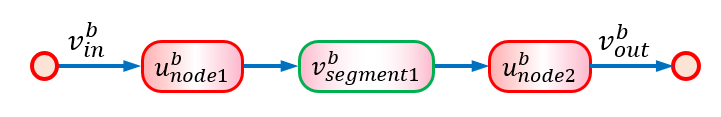
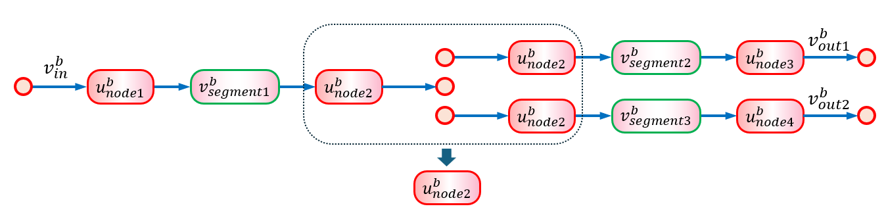
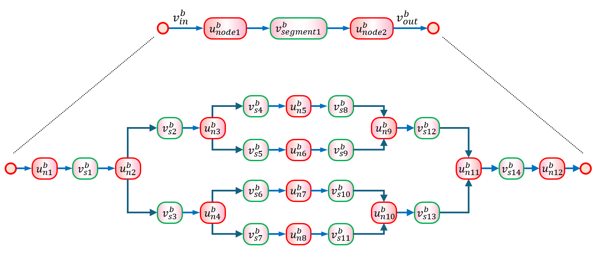

# Notes

## 16 January 2025

### Constructing branching (vascular) models from templates.

There are two separate sets of RDF:

1.  Template descriptions, such as [template.ttl](../models/template.ttl), which is a description of the basic model below, are intended to be used by model generation tools for both validation and generation.
2.  Model definitions, such as [vascular.ttl](../models/vascular.ttl), which uses `template.ttl` to define both a straight segment and a branch in a vascular network. The example only specifies interconnections, but would normally also specify model parameters and states (e.g. from ApiNATOMY).

Shape expressions are used to validate RDF structure:

1.  [template.shex](../shex/template.shex) for template descriptions.
2.  [bgmodel.shex](../shex/bgmodel.shex) for model definitions. 

### Validating RDF against shape expressions

```
poetry shell
shexeval -A models/template.ttl shex/template.shex
shexeval -A models/vascular.ttl shex/bgmodel.shex
```


## Email from PH, 11 December 2024 3:41 pm

I’ve been thinking a bit more about this and wonder if we should simplify it a bit further.

If the basic module is:



the boundary conditions can be specified as either or at the LH end and either or at the RH end. Serial additions or bifurcations are straightforward:



And insertion of a more complex network is:


